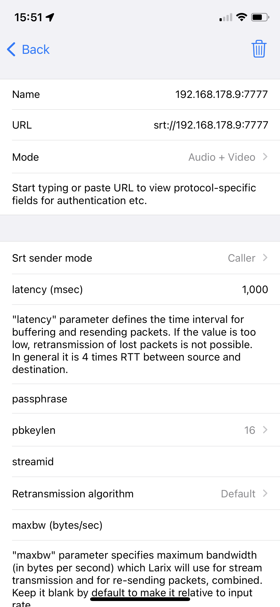

# IRL (in real life) OBS scene switcher (and Proxy)

## Why? 
I needed a small and simple tool which can proxy TCP and UDP connections, like RTMP or SRT live-streams, and can react upon the availability of these streams.

In simple terms:

This tool monitors a live-stream from your camera feed (SRT or RTMP) and when it detects a connect or disconnect it can switch scenes in Open Broadcaster Studio / OBS (https://obsproject.com/).

## How?
This is a keep-it-simple portable console application that can run on Windows, Linux, MacOS. It can run natively or in a container. Whatever your infrastructure this should work somehow.

It offers a simple JSON formatted configuration file (config.json) where you define the TCP or UDP ports that you use to deliver RTMP (using TCP) or SRT (using UDP) streams to. 

Furthermore you configure the target IP and Port where you want the data to be delivered to as well as a couple of timeouts.

### Limitations
Each remote client is mapped to a port of the local server therefore:
- The original IP of the client is hidden to the server the packets are forwarded to.
- The number of concurrent clients is limited by the number of available ports in the server running the proxy.

## Configuration
`config.json` contains the OBS WebSocket configuration and a list of forwarding rules, for instance :

{
  "OBSWebSocketConnection": {
    "OBSWebSocketHost": "localhost",
    "OBSWebSocketPort": 4444,
    "OBSWebSocketPassword": "password",
    "OBSsceneOnConnect": "connected",
    "OBSsceneOnDisconnect": "disconnected",
    "SemaphoreFileWhenConnected": "IRL-Connected.sem"    
  },
  "ProxyConnections": [
    {
      "localPort": 7777,
      "protocol": "srt",
      "forwardHost": "127.0.0.1",
      "forwardPort": 10000,
      "timeOut": 500,
      "switchToConnectedTime": 1000
    }  
  ]
}

- *OBSWebSocketHost* : The hostname/ip adress of the OBS WebSocket server
- *OBSWebSocketPort* : The port of the OBS WebSocket server as you configured it
- *OBSWebSocketPassword* : the password of the OBS WebSocket server as you configured it
- *OBSsceneOnConnect* : the OBS scene to be used when a successful connection is reported
- *OBSsceneOnDisconnect* : the OBS scene to be used when a disconnect happened
- *SemaphoreFileWhenConnected*: a file which will be created when a successful connection is made and removed when there is no connection
- *localport* : The local port the forwarder should listen to.
- *localip* : An optional local binding IP the forwarder should listen to. If empty or missing, it will listen to ANY_ADDRESS.
- *protocol* : The protocol to forward. `tcp`,`rtmp`,`udp` or `srt`
- *forwardHost* : The ip the traffic will be forwarded to.
- *forwardPort* : The port the traffic will be forwarded to.
- *timeOut* : The timeout in milliseconds to detect disconnects - this is the time after the switch to the disconnected OBS scene is made
- *switchToConnectedTime* : The wait time in milliseconds after a successful connect before switching to the connected OBS scene

## running in a container
This software can be run almost on any platform and comes with a Dockerfile in the irl-obs-switcher directory.

You can easily build the docker image yourself by running this inside the irl-obs-switcher directory:

```bash
docker build -t irl-obs-switcher .
```

This will build the image and name it "irl-obs-switcher". The default config.json will be in the /app directory inside the container and can easily be swapped/edited as you like.

Most probably you will want to change the forward hosts and OBS host settings to use the correct mapped ip adress depending on your environment.

## configuration of OBS Studio
In the obs-settings folder of there is a .json file which you can import into OBS and get some sample "connected" and "disconnected" scenes. Essentially this looks like this:

### connected scene


### disconnected scene


### larix broadcaster settings

To stream you can use something like Larix Broadcaster on iOS (or any other SRT or RTMP capable software). Be aware that, depending if you are using RTMP (=TCP) or SRT (=UDP) you have to configure all parts properly.

Also, the IP Adress 192.168.178.9 is just an example I was using - apply your host/ip of where the irl-obs-switcher is listening and then forwarding to your OBS.


